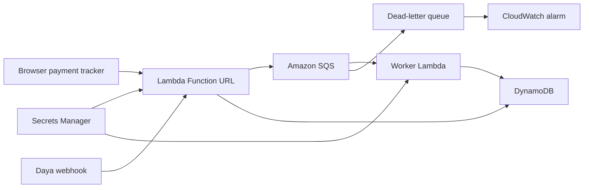

# Daya Payment Tracker

A small payments collection app that uses the Daya API to create payment details, receive payment webhooks, and reconcile deposits. AWS provides the reliable delivery layer around it: webhook receipt, queueing, background processing, storage, secrets, logs, and alerts.

This project is shaped for developer education. A non-technical viewer can understand the app as "create payment details, receive money, confirm the payment", while a developer can inspect the Daya API calls and the AWS architecture behind the flow.

## What It Builds

- Browser payment tracker
- Daya funding account creation for bank transfer and crypto address flows
- Daya webhook receiver with `X-Daya-Signature` verification
- Queue-backed webhook processing
- Reconciliation state for payment accounts, deposits, and webhook events
- Local mode for quick recording and talks
- Low-cost AWS serverless deployment with Lambda, SQS, DynamoDB, Secrets Manager, and CloudWatch
- Optional AWS containers deployment with ECS Fargate, ALB, SQS, DynamoDB, Secrets Manager, and CloudWatch

## Why Daya Matters Here

Daya is the product layer:

- It creates payment details businesses can give to customers.
- It supports bank transfer and stablecoin collection patterns through funding accounts.
- It sends signed webhook events when money arrives.
- It gives developers one API surface for building collection and reconciliation workflows.

AWS is the reliability layer:

- Lambda receives the webhook and dashboard requests.
- SQS buffers webhook events so processing can retry safely.
- A worker processes events separately from webhook receipt.
- DynamoDB stores the current reconciliation state.
- Secrets Manager stores Daya API credentials.
- CloudWatch keeps logs and raises an alarm if events reach the dead-letter queue.

## Recommended AWS Architecture

Use this path first. It is easier to deploy, does not require Docker, and avoids the higher baseline cost of an Application Load Balancer, NAT gateways, and always-on container services.



The containers stack is still included for an advanced version, especially if you want the article to lean into your AWS Containers community angle. It is more expensive to leave running, so treat it as optional unless you specifically want to show ECS.

## Local Preview

Install dependencies:

```bash
npm install
```

Create your local environment file:

```bash
cp .env.example .env
```

Start the app:

```bash
npm run dev
```

Open:

```text
http://localhost:3000
```

The app can create bank details, create a crypto address, send a test payment event, confirm the payment, and show the reconciled records.

## Smoke Test

With the app running, execute the end-to-end smoke test:

```bash
npm run smoke
```

The test clears local state, creates a bank payment account, sends a test payment event, confirms the payment, and checks that the deposit was reconciled.

## Deploy to AWS

Recommended low-cost path:

```bash
npm run cdk:serverless:synth
npm run cdk:serverless:deploy
```

Optional containers path:

```bash
npm run cdk:containers:synth
npm run cdk:containers:deploy
```

See [docs/aws-deployment-guide.md](docs/aws-deployment-guide.md) for the full checklist.

## Daya Docs Used

- Funding Accounts: https://docs.daya.co/concepts/funding-accounts
- Create Funding Account: https://docs.daya.co/api-reference/funding-accounts/create-funding-account
- Webhook Events: https://docs.daya.co/api-reference/webhooks/events
- Webhook Verification: https://docs.daya.co/api-reference/webhooks/verification
- Sandbox Testing: https://docs.daya.co/limits/sandbox-testing
- Pro Crypto Deposit Addresses: https://docs.daya.co/pro/api-reference/list-crypto-deposit-addresses

## Business API vs Pro API

This project focuses on Daya Business API funding accounts. That is the right model when you want to show how a business can collect NGN or stablecoins from customers and reconcile deposits.

Daya Pro has a separate API surface for trading, account balances, orders, withdrawals, and Pro account-level crypto deposit addresses. Keep those concepts separate unless the product flow intentionally connects Business API collections to Pro trading.
