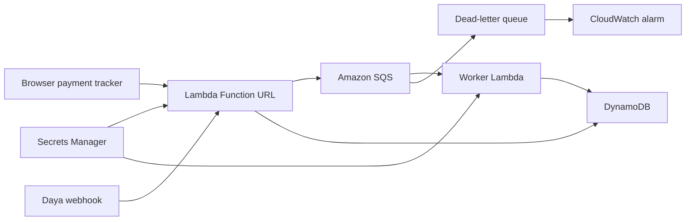

# Building a Reliable Payment Tracker with Daya Webhooks and AWS

When a product receives money from customers, the first problem is creating payment details. The next problem is knowing, reliably, when the money arrives.

That is where Daya and AWS fit well together.

Daya gives the product the payment infrastructure: funding accounts, bank-transfer collection, crypto-address collection, and webhook events. AWS gives the product the operational backbone: a webhook endpoint, a queue, a background worker, durable state, secrets, logs, and alerts.

In this walkthrough, we will build a simple payment tracker that can:

- Create bank-transfer payment details with Daya.
- Create a crypto address with Daya.
- Receive signed Daya webhooks.
- Queue payment events before processing them.
- Confirm and store reconciled payment records.
- Deploy the flow to AWS with Lambda, SQS, DynamoDB, Secrets Manager, and CloudWatch.

## The Product Flow

The user-facing flow is intentionally simple:

1. Create payment details.
2. Give those details to a customer.
3. Receive a webhook when the customer pays.
4. Confirm the payment.
5. Store the payment record.

That simplicity matters. A fintech user does not need to think in terms of queues, workers, or idempotency. They just need to know whether money arrived and whether the system accounted for it.

## The Daya Pieces

This project uses Daya Funding Accounts.

A funding account represents payment details a business can use to receive money. Depending on the rail, that can look like NGN bank-transfer details or a crypto address for stablecoin deposits.

For this project:

- `NGN_VIRTUAL_ACCOUNT` represents bank-transfer collection.
- `CRYPTO_ADDRESS` represents stablecoin collection.
- `deposit.completed` tells the app that funds arrived.
- `X-Daya-Signature` helps the app verify that the webhook came from Daya.

Relevant Daya docs:

- Funding Accounts: https://docs.daya.co/concepts/funding-accounts
- Create Funding Account: https://docs.daya.co/api-reference/funding-accounts/create-funding-account
- Webhook Events: https://docs.daya.co/api-reference/webhooks/events
- Webhook Verification: https://docs.daya.co/api-reference/webhooks/verification

## The AWS Pieces

The recommended deployment uses serverless AWS services:



Each AWS service has a clear job:

- Lambda Function URL receives dashboard requests and Daya webhooks.
- SQS stores webhook events immediately so the API can respond quickly.
- Worker Lambda processes queued events in the background.
- DynamoDB stores payment accounts, deposits, and processed webhook IDs.
- Secrets Manager stores the Daya API key and webhook secret.
- CloudWatch stores logs and raises an alarm if events reach the dead-letter queue.

This keeps the article practical. Daya shines because it is the money movement API. AWS shines because it makes the integration reliable.

## Why Queue the Webhook?

A webhook handler should do as little as possible.

The app receives the Daya webhook, verifies the signature, puts the event on SQS, and returns a success response. It does not try to do all reconciliation work during the webhook request.

That gives us:

- Faster webhook responses.
- Retryable background processing.
- A dead-letter queue for failed events.
- A cleaner place to handle downstream slowness.
- Better protection against duplicate webhook delivery.

## Idempotent Processing

Payment systems must assume events can be retried.

The worker stores webhook event IDs after processing. If the same event arrives again, the worker can skip it instead of creating duplicate payment records.

That is the difference between "we received a webhook" and "we safely reconciled a payment."

## Local Setup

Install dependencies:

```bash
npm install
```

Create the environment file:

```bash
cp .env.example .env
```

Start the app:

```bash
npm run dev
```

Open:

```text
http://localhost:3000
```

The local app uses a file-backed queue and state store, so you can record or present without AWS credentials.

## Try the Flow

In the browser:

1. Create bank details.
2. Create a crypto address.
3. Send a test payment.
4. Confirm the payment.
5. Inspect the records.

Behind the screen, that maps to:

- Daya funding account creation.
- Daya-style signed payment events.
- Queue-backed webhook handling.
- Worker-based reconciliation.
- Stored payment state.

## Deploy to AWS

The recommended deployment path is:

```bash
npm run cdk:serverless:synth
npm run cdk:serverless:deploy
```

After deploy, configure the `DayaWebhookUrl` stack output in your Daya sandbox webhook settings.

The stack outputs the app URL, webhook URL, queue URLs, and secret names.

## What About Containers?

Because I am also in the AWS Containers community, I kept an ECS Fargate version in the project too.

That path is useful if the article needs to focus directly on containers:

```bash
npm run cdk:containers:synth
npm run cdk:containers:deploy
```

The tradeoff is cost and setup. ECS Fargate with an Application Load Balancer and VPC is a stronger containers story, but it is more expensive to leave running than the serverless version.

For a public educational build, I would publish the serverless version first and mention the containers version as the advanced follow-up.

## Before Production

Before adapting this pattern for a real customer-facing product, add:

- Authentication for the dashboard.
- HTTPS and a custom domain.
- Disabled public test-payment routes.
- Alarm notifications.
- Structured tracing.
- CI/CD.
- Real reconciliation queries and indexes.
- Clear separation between Business API collection flows and Pro trading flows.

## Closing

Daya makes the payment flow possible. AWS makes the event handling reliable.

That is the core lesson: a good money movement integration is not only about calling an API. It is about receiving events, verifying them, retrying safely, avoiding duplicate processing, and giving operators confidence that every payment is accounted for.
